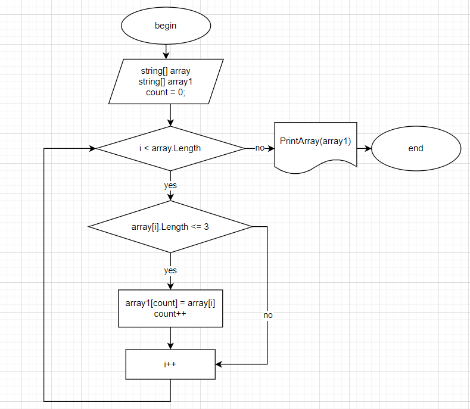

# finalGB

*Ход выполнения задания.*

Загрузила картинку с алгоритмом.

Создала два массива. Один произвольно заполнила, второй остается для вывода.
Потом создаю два метода. Первый отбирает элементы меньше или равный 3. Чтобы пройтись по всему массиву ввожу цикл **for**, дальше ввожу условие **if**, чтобы символ был меньше 3. 
Второй метод выводит массив из отобранных элементов. Тут просто пробегаюсь циклом **for** и вывожу массив.
В конце я применяю методы.
